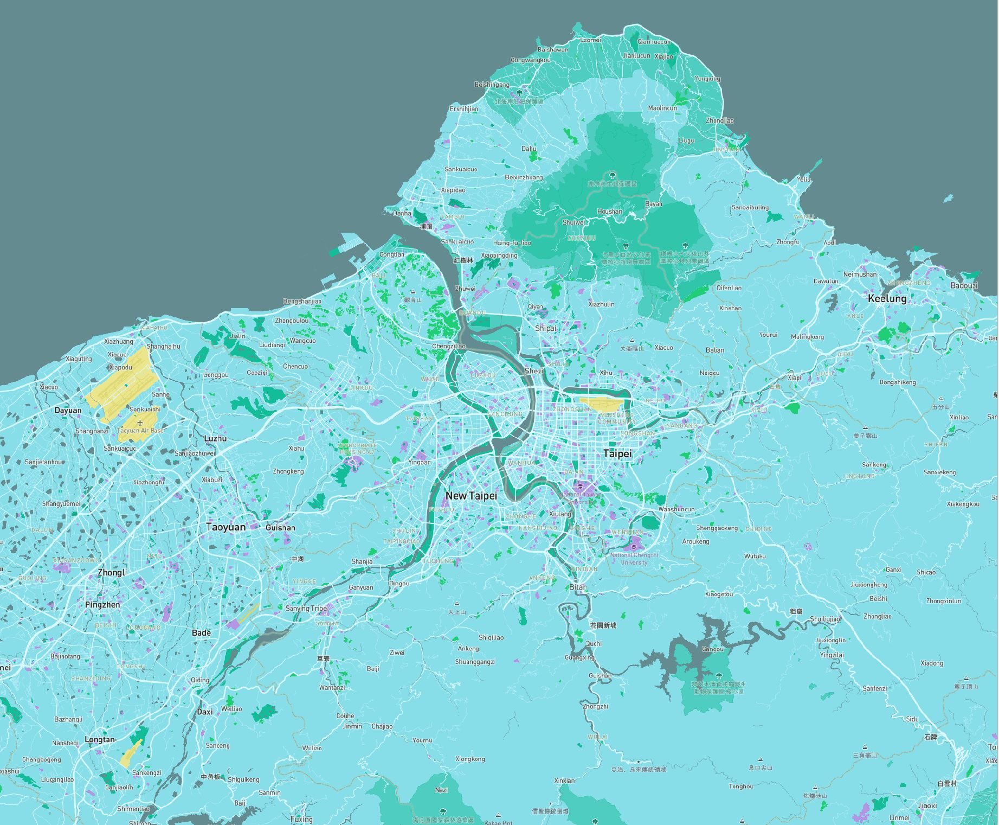

# Pokemon Go Theme Taipei Map Tile
**Author:** Angel Lin
**Date:** 2020/05/10

The theme of this map tile is inspired by the map of Pokemon Go:

I chose the `basic-chilled` template from Mapbox, and modified the style by changing the color of place lables, airports, and schools. The yellow areas on the map are airports, and the pink areas are where the schools are located at.

The map is set with a center of `[]`, and a zoom level of `12`.
