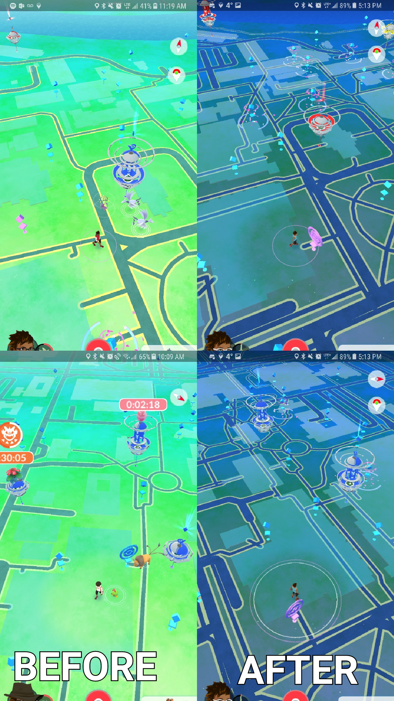

# Pokemon Go Theme Taipei Map
**Author:** Angel Lin
 **Date:** 2020/05/10
 **Website:** https://angellinn.github.io/taipei-pokemon-theme/

The theme of this map tile is inspired by the map of Pokemon Go:

The basemap is made and designed using [Mapbox Studio](https://www.mapbox.com/). In order to make my map match with the Pokemon Go theme, I chose the `basic-chilled` template, and modified the style by changing the color of water, place lables, airports, and schools. The yellow areas on the map are airports, and the pink areas are where the schools are located at.

Once the basemap is made, I imported the map to [QGIS](https://qgis.org/en/site/) and used QMetaTiles plug-in to create tiles. Then I used leaflet to display the map on the web. 

The map is set with a center of `[25.062, 121.483]`, and a default zoom level of `12`. 
